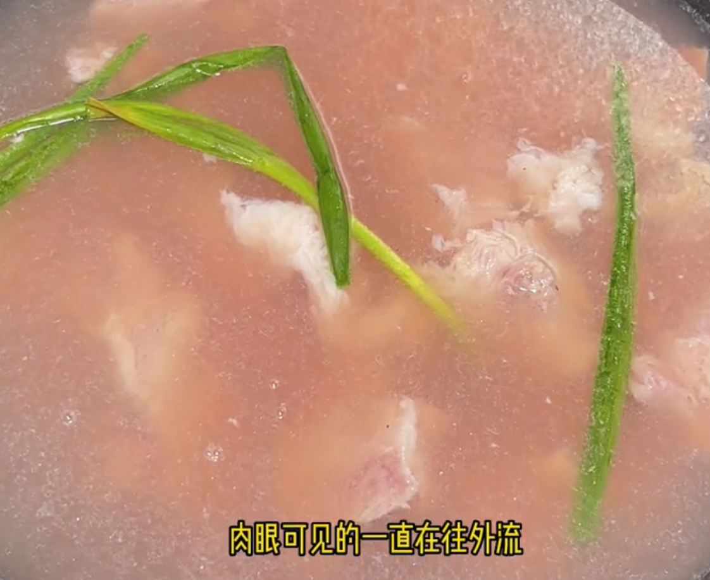

# Rezepte

  by <strong>XingyuZhou</strong> @ <em>Frankfurt am Main</em>

🥄 “一勺”：

| 对象     | 实际量    | 对象       | 实际量               |
| -------- | --------- | ---------- | -------------------- |
| 液体调料 | 15ml 量勺 | 粉粒类调料 | 比拇指大一圈的小铁勺 |
| 盐       | 1g 小木勺 | 大米       | 100ml 量勺           |

> [!WARNING]
> 一般一道两人吃的菜，如果放了 10g 盐，都会很咸了。

**肉类焯水**：

1. 冷水下锅，加入料酒，快速升温到 60 度左右。

   > 水越多，水温上升越慢，更多时间出血水。如果水很快就烧开了，就会导致肉闭合，异味来不及散出
   > 除了料酒（需要是黄酒），葱姜蒜的作用不大（时间太短）。强力去腥就放白酒。酒精渗透快，会混合异味（也包括香味），然后随着温度到 70 度左右就一起挥发掉

2. 转最小火，保持 60-70 度之间泡个 10 分钟，并拨弄几下，利于出血水。

   > 泡多久取决于肉的脂肪含量（脂肪溶于热水）。如果想保留肉类的脂肪（保留肉香），就少泡一会，如果肉非常肥，就多泡一会。
   > 生肉变白就可以。

3. 焯水后捞出用**热水**清洗。

   > 如果用冷水，一热一冷会让肉质收缩，口感发柴

<figure>
  
  <figcaption>肉眼可见血水往外流，此时水温大概 60 度左右</figcaption>
</figure>

<figure>
  
  <figcaption>锅中水滋啦响边时，此时水温大概 70 度左右</figcaption>
</figure>

**蔬菜类焯水**：

1. 热水下锅，水也要尽量多，保持 90 度以上水温。

   > 热水会破坏青菜中的叶绿素并流出来（游离叶绿素），导致青菜焯水后后更青翠。
   > 放盐可以保护游离叶绿素，因此不会发黄。

2. 焯水完后，立刻捞出放入凉水水中。

   > 同时炒菜时，也需要温度足够高才下青菜，否则也容易变黄。

**切肉**：顺纹分块，逆纹切片

**炒糖色**：

1. 锅烧热后加少许油润锅
2. 留一点油，加冰糖，中小火炒至融化

   > 尽量让糖集中，不要平摊开，否则容易烧焦；勺子也要不停搅动；可以边炒边敲冰糖帮助融化

3. 融化后转最小火，继续搅拌，知道糖液变成枣红色即可，切不可炒多了

备忘：

- 焯水后的原汤对炖肉很重要，可以焯水两次，第一次烧到 60 度左右停火倒掉，第二次煮开捞去浮沫保留原汤。
- 炖肉先加盐炖不烂的说法没有依据，相反先放盐更入味。

## 酸辣土豆丝

主料：4 个中等大小土豆 🥔，1 个青椒 🌶️

1. 土豆丝焯水三遍去除淀粉，最后沥干
2. 热油放葱姜蒜爆香，放入青椒翻炒

   > 青椒炒一小会就要放土豆，否则容易老

3. 放入土豆丝翻炒至变色
4. 加入 2 勺醋，1 勺生抽，5 勺盐翻炒均匀即可出锅

## 西红柿土豆炖牛肉

食材： Beinscheibe $\times 1000g$，西红柿 $\times 2$，罐头番茄 $\times 400g$，中等大小土豆 $\times 3$，洋葱 $\times 1$

1. 焯水后沥干
2. 葱姜蒜爆香，放牛肉，炒至上色，加入洋葱、5 勺盐、1 勺生抽，炒出香味

   > [炒糖色](#chaotangse)也可以  
   > 这一步的目的是进一步蒸发血水，因此中途如果出水过多可以倒掉，再补点油，最终目的是将肉煎糊一点以出香味

3. 加没过肉的开水，加入 2 勺料酒、3 勺生抽、1 勺老抽、 2 片香叶、 1 个八角，炖 30 分钟

   > 最好是原汤

4. 加入土豆、罐头番茄，加 5 勺盐，再炖 30 分钟
5. 放入西红柿，炖 10 分钟，大火收汁即可出锅

## 黑椒牛柳意面

主料（双人份）：1 盒 Minutensteak 牛肉、1 份一欧、 1 份 50 分硬币粗细的意面

1. 牛肉逆纹切条，加 2 勺盐、1 勺生抽、1 勺老抽、1 勺食用油、1 勺料酒、1 勺淀粉腌制
2. 加 1 勺蚝油、3 勺生抽、0.5 勺老抽、挺多黑胡椒、0.4 勺淀粉、一点水调制酱汁
3. 锅烧开水，加入少许油，4 勺盐煮开，放入意面，煮 8 分钟，捞出过冷水
4. 热锅凉油，炒熟牛肉，装出
5. 起锅烧油，炒熟青椒，洋葱丝，再放入牛肉，意面，调好的酱汁一起炒；汁收得差不多就可以出锅

## 鸡腿肉

主料（双人份）：Hähnchen-Oberkeulensteaks $\times 400g$

1. 鸡腿肉切拇指大块，加入 1 整颗蒜末、2 根小葱、2 勺料酒、2 勺生抽、0.8 勺老抽、黑胡椒粉、1 勺蚝油腌制 20 分钟

   > 因为后面要煮一段时间，小了容易老

2. 锅烧温油放鸡腿肉，中大火煎至两面焦黄

   > 油不用太多，否则最后汁水上油很多  
   > 煎糊一点才香

3. 倒入剩余料汁，并添水，大火煮开，小火盖盖焖 10 分钟

   > 水不用太多，煮久了肉容易老

4. 大火收汁即可出锅

   > 可以来点蒸鱼豉油

## 香辣鸡丁

主料（双人份）：Mini-Steaks $\times 400g$

1. 鸡肉切丁，加入 2 勺料酒、1 勺生抽、0.5 勺老抽、1 份鸡蛋液、3g 盐、少许淀粉、黑胡椒粉腌制 20 分钟
2. 准备料汁：4g 盐、1 勺鸡精、适量胡椒粉、少许白糖、1.5 勺生抽、1.5 勺料酒、少许淀粉，和匀
3. 起锅至锅底冒烟，加油润锅，放葱姜蒜、干辣椒爆香，炒香后再放入 1 勺郫县豆瓣酱炒香
4. 下入腌好的鸡丁（腌料水分过多可以过滤网），炒至五成熟后加入青椒，翻炒 1 分钟后倒入料汁
5. 至汁干油亮即可出锅

## 西红柿炒鸡蛋

主料：Tomaten $\times 3$，Eier $\times 4$

1. 鸡蛋液中加入 3 勺食盐、白醋去腥，打匀
2. 热油放入鸡蛋液，定型后再翻动，全部定型捞出
3. 葱姜蒜爆香，倒入西红柿，放 8 勺盐、0.8 勺白砂糖，将西红柿块炒出汁

   > 西红柿可以多炒会

4. 倒入鸡蛋，快速翻炒，收汁就差不多了
5. 加入香油，葱花出锅

## 小炒牛肉

主料：Minutensteak $\times 320g$

1. 牛肉切好后冷水泡 30 分钟
2. 挤干水分，1 勺老抽、1 勺生抽、1 勺料酒、1 勺油（少了容易粘锅）、一把淀粉、4g 盐腌制 20 分钟

   > 要挤干水分，腌好后没有太多水

3. 热锅热油，放入牛肉，迅速炒至变色捞出

   > 锅一定要热（到滴水会滚的那种），不要怕放肉崩油  
   > 下完牛肉不要翻炒，拨弄开不要粘在一起就行。让下面的肉焦糊一点（香），上面的肉有点生（嫩），即可盛出  
   > 牛肉出的水要倒掉，不要回锅一起炒（腥味来源）  

4. 新起锅冷油放入干辣椒，葱姜蒜爆香
5. 放入蔬菜，加 4g 盐、一勺生抽，炒至 9 分熟
6. 最后放入牛肉、一袋六婆、一点油、一点鸡精、翻炒均匀快速出锅

## 干炒平菇

主料：Austernpilze $\times 2$

1. 葱姜蒜爆香，平菇撕条攥干水分，下锅炒
2. 加入 5 勺盐，0.8 勺孜然粉炒到平菇收缩变小后，加半袋六婆出锅

## 香菇鸡肉饭

主料：1 盒鸡胸肉 🐔，10 个干香菇 🍄；1 根胡萝卜 🥕，2.5 勺大米 🍚

1. 干香菇提前泡水两三个小时
2. 鸡胸肉切块，加入 2 勺料酒，5 勺盐，0.8 勺淀粉，黑胡椒粉腌制
3. 热油下入鸡块炒至变色，盛出
4. 胡萝卜，香菇切丁，放锅里也炒一下
5. 和淘好的米一起放入电饭锅，再加 2 勺生抽，5 勺盐，选择 30 分钟煮饭档

## 煎排骨

主料：Lidl 冷冻排骨 1 条

1. 6 档火热锅
2. 冷油下入排骨，每面煎 4 分钟

## 煎牛排

原料：牛排 🥩，黑胡椒粉，橄榄油，迷迭香

1. 去除包装袋室温放置一会，厨房纸吸去血水

   > 必须恢复到室温，否则煎的时候容易外熟内生；也只能静置恢复，否则口感不行

2. 抹橄榄油，黑胡椒粉，盐腌制半小时
3. 热锅热油，9 档大火放入牛排，每面煎 40 秒
4. 转 5 档中火，放入蒜粒，每面煎 1 分钟
5. 放入黄油，根据厚度每面浇油 3~5 分钟

   > 黄油不要放太早，容易焦

6. 出锅醒肉 4 分钟

## 牛肉萝卜汤

主料（双人份）：Beinscheibe $\times 1$，白萝卜 $\times 1$

1. 牛肉切块并[焯水](#rouchaoshui)
2. 牛肉加葱姜蒜、2 勺料酒入锅，添冷水没过牛肉一节手指，中火煮沸，撇去血沫

   > 水不要加得太多，否则后面咸了不好兑水

3. 加入 3 个八角、5 片香叶、5g 盐，转小火盖盖炖 40 分钟
4. 萝卜去皮切块加入，补 4g 盐、2 勺生抽、0.6 勺老抽（1 勺汤颜色稍微有点深）、适量鸡精，再炖 30 分钟

   > 老抽不要多，否则汤不好看

5. 尝尝咸淡（以肉的咸淡为准），咸了就加水，再炖 10 分钟即可

## 蛋炒饭

主料：隔夜米饭 $\times 250 ml$，鸡蛋 $\times 4$

> [!NOTE]
> 米饭需要放相对少的水煮。

1. 剩饭加入 1 勺食用油、 1 勺生抽、0.5 勺老抽、0.8 勺蚝油、少许黑胡椒，拌匀，放置 3 小时
2. 打入四个鸡蛋，加入 1 勺盐，不用打散，直接热锅热油下，炒散
3. 加入蔬菜、虾仁、1 勺生抽炒香

   > 不建议放会炒出水的蔬菜。

4. 加入米饭，1 勺鸡精翻炒至干巴即可出锅

## 空气炸锅烤羊肉

主料：4 个 T 型羊排肉 🐑，1 个洋葱 🧅

1. 羊肉切块，洋葱切碎
2. 加入葱，姜，洋葱，50ml 料酒，30ml 生抽，少许盐，半勺孜然粉，少许黑胡椒粉，抓匀腌制 1h
3. 空气炸锅底部铺锡纸，戳几个洞便于水流出去
4. 190 度，20-30 分钟，每隔 10 分钟打开翻面
5. 出锅撒入六婆

## 孜然羊肉

主料：羊肉

1. 羊肉切片
2. 加入 1 勺六婆，1.2 勺孜然粉，0.5 勺花椒粉，挺多黑胡椒，1 个蛋清，30 ml 生抽，50ml 料酒，一小勺淀粉，抓匀腌制 1h
3. 葱姜蒜切好备用，放 2 勺孜然粒，1 勺六婆，1 勺白芝麻，0.5 勺胡椒粉，3g 盐，备用
4. 锅中放多点油，微微热后加入腌制好的羊肉，大火炒至金黄，炒好盛出备用
5. 用炒羊肉剩下的油，倒入葱姜蒜爆香，放入粉料，再放入羊肉，大火炒匀出锅

## 水煮牛肉

主料（双人份）：Rinderwade/Beinscheibe $\times 500g$、中等大小土豆 $\times 2$、生菜、豆芽

1. 牛肉切片，去血水后，加入 10g 盐、2 勺料酒、2 勺生抽、3 勺淀粉、少许油抓匀腌制
2. 蒜、青红花椒爆香，放入牛油火锅底料，炒至完全融化后立即加开水

   > 融化后立即加开水，否则底料容易炒糊

3. 水开放土豆煮 5 分钟，放入牛肉煮 3 分钟，再放蔬菜煮 3 分钟即可出锅

## 红烧排骨

主料：Schweine-Schälrippchen $\times 770g$

1. 排骨切 5cm 左右段，[焯水](#rouchaoshui)，后温水清洗
2. 一手心冰糖[炒糖色](#chaotangse)后倒入排骨，快速翻炒至上色
3. 上色后，加入葱姜、2 颗八角、2 勺料酒、6 勺盐，继续翻炒至出香味
4. 出香味后加入 2 勺生抽继续翻炒一小会

   > 不能放老抽，否则颜色发黑

5. 加入开水没过排骨，炖 30 分钟

   > 加入开水，如果是凉水，一热一冷会让肉质收缩，口感发柴

6. 大火收汁出锅

## 排骨炖豆角

主料：Schweine-Schälrippchen $\times 860g$

1. 排骨切 5cm 左右段，[焯水](#rouchaoshui)，后温水清洗沥干
2. 葱姜炒香，加排骨，加 2 个八角、3 勺生抽、1 勺老抽、8 勺盐、2 勺料酒炒至酱油基本被吸收

   > 盐要一次性放足，提前放盐可以让肉更耐炖，锁住肉香

3. 加水没过排骨，补 1 勺生抽、2 片香叶、1 节桂皮，大火炖 10 分钟后转小火炖 10 分钟
4. 豆角切段，热锅热油下入，补 2 勺盐炒至翠绿

   > 豆角外部有层保护膜，如果不通过高位翻炒破坏掉，光靠水煮是不够的，就会导致很久炖不熟。  
   > 油需要多一点，因为锅温很高，多一点油可以让豆角和锅之间有个缓冲，而且会让豆角炒出来更绿。

5. 排骨中加入豆角和土豆，补 1 勺生抽、4 勺盐、1 勺老抽、1 勺鸡精再小火炖 25 分钟。
6. 大火收汁出锅

## 红烧鸡翅

主料：Hähnchen-Flügel $\times 1100g$

1. 鸡翅正反各划两刀，[焯水](#rouchaoshui)，后温水清洗
2. 锅中油热，葱姜爆香，煎至两面金黄

   > 太多可分两锅煎

3. 加入 2 勺料酒、3 勺生抽、1 勺老抽、1 勺蚝油炒香
4. 加入开水没过鸡翅，加入 6 勺盐、1 勺鸡精、2 颗冰糖、3 个八角、桂皮、4 片香叶，中火焖 20 分钟
5. 大火收汁即可出锅
